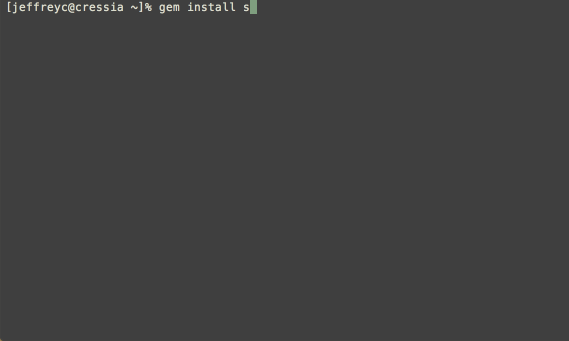

# Swagger::Diff

[](https://travis-ci.org/civisanalytics/swagger-diff)
[](http://badge.fury.io/rb/swagger-diff)
[](https://gemnasium.com/civisanalytics/swagger-diff)



> You can tell me by the way I walk - Genesis

Swagger::Diff is a utility for comparing two different
[Open API Initiative (OAI)](https://openapis.org/) specifications (fka
[Swagger](http://swagger.io/) specifications).
Its intended use is to determine whether a newer API specification is
backwards-compatible with an older API specification.
It provides both an [RSpec](http://rspec.info/) matcher and helper functions
that can be used directly.
Specifications are considered backwards compatible if:

- all path and verb combinations in the old specification are present in the
  new one
- no request parameters are required in the new specification that were not
  required in the old one
- all request parameters in the old specification are present in the new one
- all request parameters in the old specification have the same type in the
  new one
- all response attributes in the old specification are present in the new one
- all response attributes in the old specification have the same type in the new
  one

It can also be used to enumerate all changes between two specifications (*i.e.*,
to generate a changelog).

Read more on the [Civis Analytics blog](https://www.civisanalytics.com/blog/if-it-loses-its-quack-does-it-still-talk-like-a-duck-using-swagger-to-detect-breaking-api-changes/).

## Installation

Add this line to your application's Gemfile:

```ruby
gem 'swagger-diff'
```

And then execute:

    $ bundle

Or install it yourself as:

    $ gem install swagger-diff

## Usage

OAI specifications can be any valid OAI file format, raw or parsed:

- the path to a file containing an OAI specification.
  This may be local (*e.g.*, `/path/to/specification.json`) or remote (*e.g.*,
  `http://host.domain/specification.yml`)
- a Hash containing a parsed OAI specification (*e.g.*, the output of
  `JSON.parse`)
- a string of JSON containing an OAI specification
- a string of YAML containing an OAI specification

### RSpec

```ruby
expect(<new>).to be_compatible_with(<old>)
```

If `new` is incompatible with `old`, the spec will fail and print a list of
backwards-incompatibilities.

### Direct Invocation

If you are not using RSpec, you can directly invoke the comparison function:

```ruby
diff = Swagger::Diff::Diff.new(<old>, <new>)
diff.compatible?
```

It will return `true` if `new` is compatible with `old`, `false` otherwise.
`#incompatibilities` will return a hash containing the incompatible endpoints,
request parameters, and response attributes; *e.g.*,

```ruby
{ endpoints: ['put /a/{}'],
  request_params: {
    'get /a/' => ['missing request param: limit (in: query, type: integer)'],
    'post /a/' => ['new required request param: extra'],
    'put /b/{}' => ['new required request param: extra']
  },
  response_attributes: {
    'post /a/' => ['missing attribute from 200 response: description (in: body, type: string)'],
    'get /a/{}' => ['missing attribute from 200 response: description (in: body, type: string)'],
    'put /b/{}' => ['missing attribute from 200 response: description (in: body, type: string)']
  }
}
```

You can also directly invoke the changes function:

```ruby
diff = Swagger::Diff::Diff.new(<old>, <new>)
diff.changes
```

`#changes` will return a hash containing the changed endpoints, request
parameters, and response attributes; *e.g.*,

```ruby
{ new_endpoints: ['delete /pets/{}', 'get /pets/{}', 'post /pets'],
  new_request_params: {
    'get /pets' => ['new request param: tags (in: query, type: array)',
                    'new request param: limit (in: query, type: integer)'] },
  new_response_attributes: {},
  removed_endpoints: [],
  removed_request_params: {},
  removed_response_attributes: {}
}
```

### Command-Line

It also includes a command-line version:

```bash
$ swagger-diff -i <old> <new>
```

`swagger-diff` will print a list of any backwards-incompatibilities `new` has
when compared to `old`.

For backwards-compatibility with previous versions of `swagger-diff`, the `-i`
argument is optional:

```bash
$ swagger-diff <old> <new>
```

The command-line version can also be used to generate a list of all changes
(*i.e.*, a changelog):

```bash
$ swagger-diff -c <old> <new>
```

## Gem Development

After checking out the repo, run `bin/setup` to install dependencies.
Then, run `bin/console` for an interactive prompt that will allow you to experiment.

To install this gem onto your local machine, run `bundle exec rake install`.
To release a new version, update the version number in `version.rb`, and then run `bundle exec rake release` to create a git tag for the version, push git commits and tags, and push the `.gem` file to [rubygems.org](https://rubygems.org).

## Contributing

See [CONTRIBUTING](CONTRIBUTING.md).

## License

Swagger::Diff is released under the [BSD 3-Clause License](LICENSE.md).

## OpenAPI (fka Swagger) Specification License

Swagger::Diff includes an
[unmodified copy of the OpenAPI Specification](schema/oai/schema.json).
The OpenAPI Specification is licensed under the
[Apache License, Version 2.0](schema/oai/LICENSE.md).

## JSON Schema Specification License

Swagger::Diff includes an
[unmodified copy of the JSON Schema Specification, draft v4](schema/json/schema.json).
The JSON Schema Specification is licensed under the
[Simplified BSD License](schema/json/LICENSE.md).
